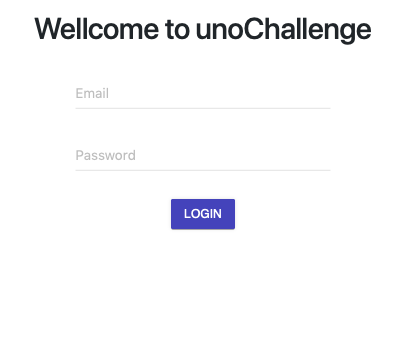
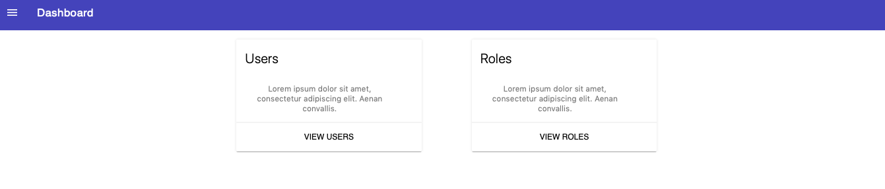
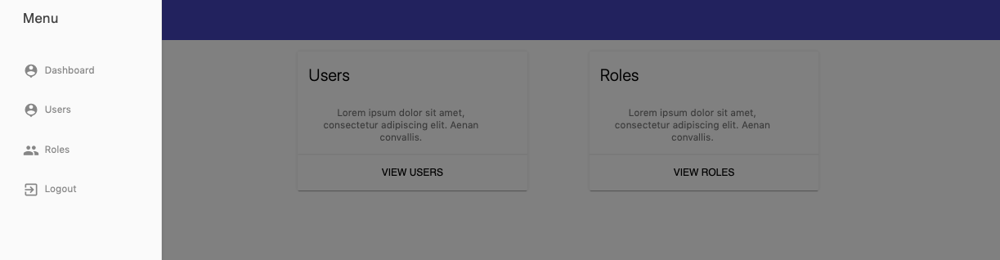

# UnoChallenge

This web app was made in [Angular CLI](https://github.com/angular/angular-cli) version 7.0.3 and integrated with firebase authentication and database. UnoChallenge is a web app to manage(create, edit and delete) users and user's roles. 

### Some implementation details

To build this app was used two angular libraries:
* [angular2-mdl](https://www.npmjs.com/package/angular2-mdl);
* [angularfire2](https://github.com/angular/angularfire2).

## Installation & Development

1. clone this repo: `git clone https://github.com/renatogslopes/unoChallenge.git`
2. `cd unoChallenge`
3. `npm install`
4. run `ng serve` from a terminal
5. The app will automatically reload if you change any of the source files.

## UnoChallenge - What you'll see. 

Login Page

Dashboard Page

Side Menu

## Build

Run `ng build` to build the project. The build artifacts will be stored in the `dist/` directory. Use the `--prod` flag for a production build.

## To improve in the future

1. Fix the bug when the user try to add or remove a role for user that already exist. 
2. Implement the NgRx.

## Running unit tests

Run `ng test` to execute the unit tests via [Karma](https://karma-runner.github.io).

## Author
Renato Lopes 